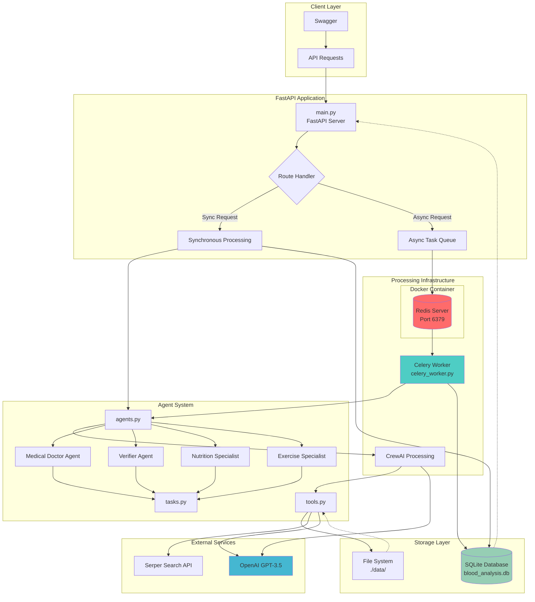
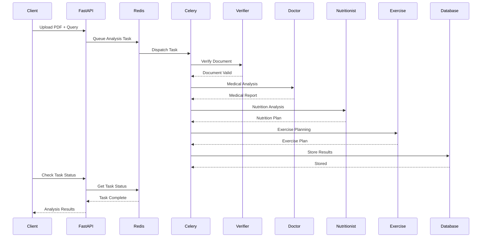

# Blood Test Report Analyzer

A comprehensive AI-powered system for analyzing blood test reports using multi-agent architecture with both synchronous and asynchronous processing capabilities.

## Setup Video Tutorial

For a detailed video walkthrough of the setup process, [click here](https://drive.google.com/file/d/1P1MDRQm1g7Idhr6fwe4qjaEivr5wgciT/view?usp=sharing).

## Project Architecture



## Major Bugs Fixed from Original System

### 1. Import and Dependency Issues

**Original Problems:**
- Missing PDFLoader import in tools.py
- Undefined llm variable in agents.py
- Circular import issues between modules

**Fixes Applied:**
- Replaced missing imports with proper PyPDF2 implementation
- Added proper LLM initialization with ChatOpenAI in agents.py
- Restructured imports to eliminate circular dependencies
- Added comprehensive environment variable management with .env file

### 2. Agent Configuration Problems

**Original Problems:**
- Unprofessional agent backstories (Dr. House parody, supplement salesperson)
- Goals focused on providing unreliable medical advice
- Tools incorrectly configured as individual functions instead of lists

**Fixes Applied:**
- Professional Medical Doctor Agent: 15+ years experience in laboratory medicine
- Document Verifier Agent: Medical records specialist for validation
- Clinical Nutritionist: Certified with master's degree in nutrition science
- Exercise Physiologist: Certified fitness specialist with medical expertise
- Proper tool configuration with lists and appropriate tool assignments
- Professional, evidence-based goals and backstories

### 3. Task Definition Issues

**Original Problems:**
- Unprofessional task descriptions encouraging misinformation
- Expected outputs requesting fake URLs and made-up medical advice
- Tasks encouraging contradictory and harmful recommendations

**Fixes Applied:**
- Professional Task Descriptions: Evidence-based, medically accurate
- Comprehensive Task Structure: Verification → Analysis → Nutrition → Exercise
- Safety-First Approach: Emphasizes healthcare provider consultation
- Context-Aware Tasks: Proper task dependencies and information flow
- Medical Disclaimers: Built into all task outputs

### 4. Tool Implementation Problems

**Original Problems:**
- BloodTestReportTool methods were async but not properly structured
- Missing proper error handling
- Tools not properly integrated with CrewAI framework

**Fixes Applied:**
- Synchronous Tool Implementation: Proper _run methods
- Comprehensive Error Handling: File validation, permission checks, content verification
- PDF Processing: Robust PyPDF2 implementation with text extraction
- Input Validation: Pydantic schemas for all tool inputs
- Proper Tool Integration: BaseTool inheritance with correct configurations

### 5. API Issues

**Original Problems:**
- No proper error handling for file uploads
- Missing validation for file types
- No proper cleanup mechanisms
- Single-threaded processing (no concurrency support)

**Fixes Applied:**
- Comprehensive File Validation: PDF type checking, size validation, existence verification
- Robust Error Handling: HTTP exceptions with detailed error messages
- File Cleanup: Automatic file removal after processing
- Multiple Processing Options: Sync and async processing modes
- CORS Support: Cross-origin request handling
- Request Validation: Pydantic models for all endpoints

### 6. Missing Core Functionality

**Original Problems:**
- No actual nutrition analysis implementation
- No exercise planning logic

**Fixes Applied:**
- Intelligent Nutrition Analysis: Blood marker-specific dietary recommendations
- Comprehensive Exercise Planning: Health condition-aware fitness recommendations
- Evidence-Based Recommendations: Scientific approach to health advice
- Safety Considerations: Medical clearance requirements and contraindications

### 7. Security and Safety Issues

**Original Problems:**
- Code encouraged providing medical advice without proper disclaimers
- No input validation
- File handling without proper security checks

**Fixes Applied:**
- Medical Disclaimers: Required in all outputs
- Professional Standards: Healthcare provider consultation emphasis
- Secure File Handling: Path validation, permission checks
- Input Sanitization: Comprehensive validation at all endpoints

## Features

### Core Functionality
- **PDF Blood Test Report Analysis**: Extract and interpret laboratory values from PDF reports
- **Multi-Agent AI System**: Specialized agents for medical analysis, nutrition, and exercise recommendations
- **Dual Processing Modes**: Both synchronous and asynchronous processing options
- **Comprehensive Analysis**: Medical interpretation, nutritional guidance, and exercise planning

### Technical Features
- **FastAPI Framework**: Modern, fast web framework with automatic API documentation
- **Celery Integration**: Distributed task queue for handling long-running analyses
- **Redis Backend**: In-memory data store for task queuing and caching
- **SQLite Database**: Persistent storage for analysis history and results
- **Docker Support**: Containerized Redis deployment
- **Multi-Agent Architecture**: CrewAI-powered intelligent agent coordination

## System Architecture

### Processing Modes

#### 1. Synchronous Processing
```
Client Request → FastAPI → CrewAI Agents → Direct Response
```
- **Use Case**: Quick analyses, immediate results needed
- **Pros**: Instant feedback, simpler debugging
- **Cons**: Blocks API during processing, timeout risks for large files

#### 2. Asynchronous Processing
```
Client Request → FastAPI → Celery Task → Redis Queue → Celery Worker → CrewAI Agents → Database
```
- **Use Case**: Complex analyses, large files, comprehensive reports
- **Pros**: Non-blocking, scalable, handles long-running tasks
- **Cons**: Requires polling for results, more complex architecture

### Agent Workflow



##  Installation & Setup

### Prerequisites
- Python 3.10+
- Docker (for Redis)
- Anaconda/Miniconda (recommended)

### Environment Setup

#### 1. Clone the Repository
```bash
git clone https://github.com/vinu0404/Crew-ai-Celery-Task.git
cd Crew-ai-Celery-Task
```

#### 2. Create Environment Variables
Create a `.env` file with:
```env
OPENAI_API_KEY=your_openai_api_key_here
SERPER_API_KEY=your_serper_api_key_here
DATABASE_URL=sqlite:///./blood_analysis.db
REDIS_URL=redis://localhost:6379/0
CELERY_BROKER_URL=redis://localhost:6379/0
CELERY_RESULT_BACKEND=redis://localhost:6379/0
```

### Quick Start (Windows)

#### Option 1: Full Setup
```powershell
./run.ps1
```

#### Option 2: Quick Run (if environment exists)
```powershell
./quick_run.ps1
```

### Manual Setup

#### 1. Create Conda Environment
```bash
conda create -n blood_test_env python=3.10 -y
conda activate blood_test_env
```

#### 2. Install Dependencies
```bash
# Core packages via conda-forge
conda install -c conda-forge fastapi uvicorn python-dotenv python-multipart redis-py sqlalchemy alembic pydantic onnxruntime tokenizers tqdm -y

# Additional packages via pip
pip install crewai crewai-tools PyPDF2 langchain-community openai celery chromadb
```

#### 3. Start Redis (Docker)
```bash
docker run -d -p 6379:6379 redis:latest
```

#### 4. Initialize Database
```python
python -c "from database import init_db; init_db()"
```

### Docker Deployment

```bash
# Start all services
docker-compose up -d

# View logs
docker-compose logs -f

# Stop services
docker-compose down
```

## Usage

### Starting the Services

#### 1. Start Redis (if not using Docker Compose)
```bash
docker run -d -p 6379:6379 redis:latest
```

#### 2. Start the FastAPI Server
```bash
uvicorn main:app --host 0.0.0.0 --port 8000 --reload
```

#### 3. Start Celery Worker (for async processing)
```bash
# Windows
./start_celery.ps1

# Linux/Mac
celery -A celery_worker worker --loglevel=info
```

### API Endpoints

#### Core Analysis Endpoints

**1. Synchronous Analysis**
```http
POST /analyze
Content-Type: multipart/form-data

file: blood_test_report.pdf
query: "Summarize my blood test results"
async_processing: false
```

**2. Asynchronous Analysis**
```http
POST /analyze
Content-Type: multipart/form-data

file: blood_test_report.pdf
query: "What are my health risks?"
async_processing: true
```

**3. Comprehensive Analysis (Always Async)**
```http
POST /analyze/comprehensive
Content-Type: multipart/form-data

file: blood_test_report.pdf
query: "Provide full analysis with nutrition and exercise recommendations"
```

#### Status and History Endpoints

**Check Task Status**
```http
GET /task/{task_id}
```

**Get Analysis History**
```http
GET /analysis/history?limit=10&offset=0
```

**Get Specific Analysis**
```http
GET /analysis/{analysis_id}
```

**System Statistics**
```http
GET /stats
```

### Screenshots


### Example Usage

```python
import requests

# Synchronous analysis
with open('blood_test.pdf', 'rb') as f:
    response = requests.post(
        'http://localhost:8000/analyze',
        files={'file': f},
        data={
            'query': 'Explain my cholesterol levels',
            'async_processing': False
        }
    )
    result = response.json()
    print(result['analysis'])

# Asynchronous analysis
with open('blood_test.pdf', 'rb') as f:
    response = requests.post(
        'http://localhost:8000/analyze',
        files={'file': f},
        data={
            'query': 'Provide comprehensive health assessment',
            'async_processing': True
        }
    )
    task_id = response.json()['task_id']

# Check status
status_response = requests.get(f'http://localhost:8000/task/{task_id}')
print(status_response.json())
```

##  Agent System

### Agent Roles

#### 1. Medical Doctor Agent
- Primary medical analysis
- Laboratory value interpretation
- Clinical significance assessment
- Health risk identification

#### 2. Verifier Agent
- Document validation
- Data extraction verification
- Quality assurance

#### 3. Nutrition Specialist Agent
- Nutritional deficiency analysis
- Dietary recommendations
- Supplement suggestions

#### 4. Exercise Specialist Agent
- Exercise safety assessment
- Fitness recommendations
- Activity planning

### Task Coordination


##  Database Schema

```sql
-- Blood Analysis Table
CREATE TABLE blood_analyses (
    id INTEGER PRIMARY KEY,
    filename VARCHAR NOT NULL,
    query TEXT NOT NULL,
    analysis_result TEXT NOT NULL,
    created_at DATETIME DEFAULT CURRENT_TIMESTAMP,
    processing_time FLOAT,
    status VARCHAR DEFAULT 'completed'
);

-- User Table
CREATE TABLE users (
    id INTEGER PRIMARY KEY,
    email VARCHAR UNIQUE,
    created_at DATETIME DEFAULT CURRENT_TIMESTAMP,
    total_analyses INTEGER DEFAULT 0
);
```

## Monitoring & Debugging

### Health Checks
- **API Health**: `GET /health`
- **System Status**: `GET /`
- **Statistics**: `GET /stats`

### Logging
- FastAPI server logs: Console output
- Celery worker logs: `--loglevel=info`
- Redis logs: Docker container logs

### Common Issues

#### 1. Redis Connection Failed
```bash
# Check if Redis is running
docker ps | grep redis

# Start Redis if not running
docker run -d -p 6379:6379 redis:latest
```

#### 2. File Not Found Errors
- Ensure `data/` directory exists
- Check file permissions
- Verify absolute paths in Celery worker

#### 3. API Key Issues
- Verify `.env` file exists and is properly formatted
- Check OpenAI API key validity
- Ensure Serper API key is active

##  Performance Optimization

### Scaling Considerations

#### 1. Multiple Celery Workers
```bash
# Start multiple workers
celery -A celery_worker worker --concurrency=4 --loglevel=info
```

#### 2. Redis Configuration
```yaml
# docker-compose.yml
redis:
  image: redis:latest
  command: redis-server --maxmemory 256mb --maxmemory-policy allkeys-lru
```

### Project Structure
```
Crew-ai-Celery-Task/
├── main.py              # FastAPI application
├── agents.py            # AI agent definitions
├── tasks.py             # CrewAI task definitions
├── tools.py             # Custom tools (PDF reader, etc.)
├── celery_worker.py     # Celery task definitions
├── database.py          # Database models and setup
├── requirements.txt     # Python dependencies
├── docker-compose.yml   # Docker services
├── Dockerfile          # Container definition
├── .env                # Environment variables
├── data/               # Temporary file storage
├── run.ps1             # Full setup script
├── quick_run.ps1       # Quick start script
└── start_celery.ps1    # Celery worker script
```

##  Requirements

### Core Dependencies
- FastAPI
- uvicorn
- crewai
- openai
- celery
- redis
- PyPDF2
- SQLAlchemy
- Pydantic

### Development Dependencies
- python-multipart
- python-dotenv
- chromadb
- langchain-community
- crewai-tools

- **CrewAI** for the multi-agent framework
- **FastAPI** for the web framework
- **OpenAI** for the language models
- **Celery** for distributed task processing
- **Redis** for caching and message brokering
