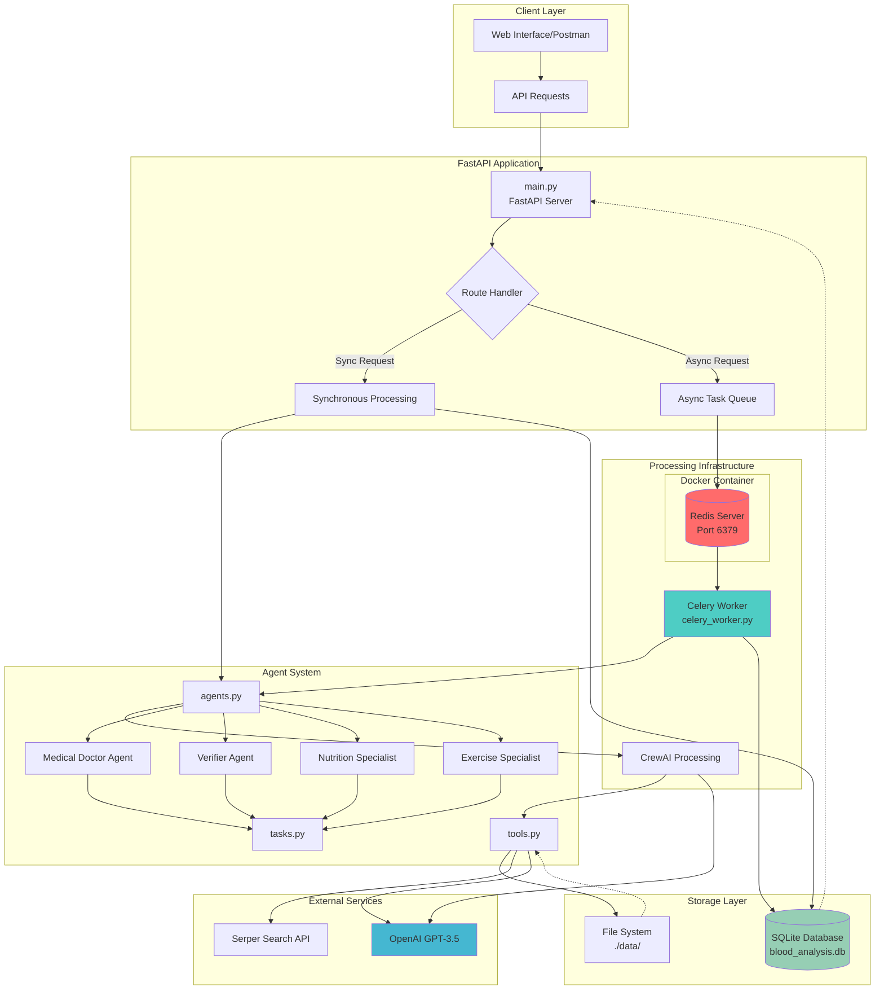
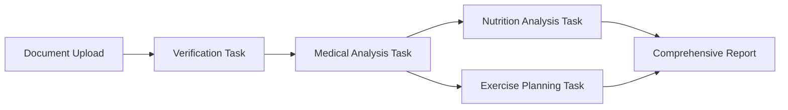

# Blood Test Report Analyzer

A comprehensive AI-powered system for analyzing blood test reports using multi-agent architecture with both synchronous and asynchronous processing capabilities.

## 🏗️ Project Architecture



## 🚀 Features

### Core Functionality
- **PDF Blood Test Report Analysis**: Extract and interpret laboratory values from PDF reports
- **Multi-Agent AI System**: Specialized agents for medical analysis, nutrition, and exercise recommendations
- **Dual Processing Modes**: Both synchronous and asynchronous processing options
- **Comprehensive Analysis**: Medical interpretation, nutritional guidance, and exercise planning

### Technical Features
- **FastAPI Framework**: Modern, fast web framework with automatic API documentation
- **Celery Integration**: Distributed task queue for handling long-running analyses
- **Redis Backend**: In-memory data store for task queuing and caching
- **SQLite Database**: Persistent storage for analysis history and results
- **Docker Support**: Containerized Redis deployment
- **Multi-Agent Architecture**: CrewAI-powered intelligent agent coordination

## 🏛️ System Architecture

### Processing Modes

#### 1. Synchronous Processing
```
Client Request → FastAPI → CrewAI Agents → Direct Response
```
- **Use Case**: Quick analyses, immediate results needed
- **Pros**: Instant feedback, simpler debugging
- **Cons**: Blocks API during processing, timeout risks for large files

#### 2. Asynchronous Processing
```
Client Request → FastAPI → Celery Task → Redis Queue → Celery Worker → CrewAI Agents → Database
```
- **Use Case**: Complex analyses, large files, comprehensive reports
- **Pros**: Non-blocking, scalable, handles long-running tasks
- **Cons**: Requires polling for results, more complex architecture

### Agent Workflow


## 🛠️ Installation & Setup

### Prerequisites
- Python 3.10+
- Docker (for Redis)
- Anaconda/Miniconda (recommended)

### Environment Setup

1. **Clone the Repository**
```bash
git clone <repository-url>
cd blood-test-analyzer
```

2. **Create Environment Variables**
Create a `.env` file with:
```env
OPENAI_API_KEY=your_openai_api_key_here
SERPER_API_KEY=your_serper_api_key_here
DATABASE_URL=sqlite:///./blood_analysis.db
REDIS_URL=redis://localhost:6379/0
CELERY_BROKER_URL=redis://localhost:6379/0
CELERY_RESULT_BACKEND=redis://localhost:6379/0
```

### Quick Start (Windows)

**Option 1: Full Setup**
```powershell
./run.ps1
```

**Option 2: Quick Run (if environment exists)**
```powershell
./quick_run.ps1
```

### Manual Setup

1. **Create Conda Environment**
```bash
conda create -n blood_test_env python=3.10 -y
conda activate blood_test_env
```

2. **Install Dependencies**
```bash
# Core packages via conda-forge
conda install -c conda-forge fastapi uvicorn python-dotenv python-multipart redis-py sqlalchemy alembic pydantic onnxruntime tokenizers tqdm -y

# Additional packages via pip
pip install crewai crewai-tools PyPDF2 langchain-community openai celery chromadb
```

3. **Start Redis (Docker)**
```bash
docker run -d -p 6379:6379 redis:latest
```

4. **Initialize Database**
```python
python -c "from database import init_db; init_db()"
```

### Docker Deployment

```bash
# Start all services
docker-compose up -d

# View logs
docker-compose logs -f

# Stop services
docker-compose down
```

## 🚦 Usage

### Starting the Services

1. **Start Redis (if not using Docker Compose)**
```bash
docker run -d -p 6379:6379 redis:latest
```

2. **Start the FastAPI Server**
```bash
uvicorn main:app --host 0.0.0.0 --port 8000 --reload
```

3. **Start Celery Worker (for async processing)**
```bash
# Windows
./start_celery.ps1

# Linux/Mac
celery -A celery_worker worker --loglevel=info
```

### API Endpoints

#### Core Analysis Endpoints

**1. Synchronous Analysis**
```http
POST /analyze
Content-Type: multipart/form-data

file: blood_test_report.pdf
query: "Summarize my blood test results"
async_processing: false
```

**2. Asynchronous Analysis**
```http
POST /analyze
Content-Type: multipart/form-data

file: blood_test_report.pdf
query: "What are my health risks?"
async_processing: true
```

**3. Comprehensive Analysis (Always Async)**
```http
POST /analyze/comprehensive
Content-Type: multipart/form-data

file: blood_test_report.pdf
query: "Provide full analysis with nutrition and exercise recommendations"
```

#### Status and History Endpoints

**Check Task Status**
```http
GET /task/{task_id}
```

**Get Analysis History**
```http
GET /analysis/history?limit=10&offset=0
```

**Get Specific Analysis**
```http
GET /analysis/{analysis_id}
```

**System Statistics**
```http
GET /stats
```

### Example Usage

```python
import requests

# Synchronous analysis
with open('blood_test.pdf', 'rb') as f:
    response = requests.post(
        'http://localhost:8000/analyze',
        files={'file': f},
        data={
            'query': 'Explain my cholesterol levels',
            'async_processing': False
        }
    )
    result = response.json()
    print(result['analysis'])

# Asynchronous analysis
with open('blood_test.pdf', 'rb') as f:
    response = requests.post(
        'http://localhost:8000/analyze',
        files={'file': f},
        data={
            'query': 'Provide comprehensive health assessment',
            'async_processing': True
        }
    )
    task_id = response.json()['task_id']

# Check status
status_response = requests.get(f'http://localhost:8000/task/{task_id}')
print(status_response.json())
```

## 🤖 Agent System

### Agent Roles

1. **Medical Doctor Agent**
   - Primary medical analysis
   - Laboratory value interpretation
   - Clinical significance assessment
   - Health risk identification

2. **Verifier Agent**
   - Document validation
   - Data extraction verification
   - Quality assurance

3. **Nutrition Specialist Agent**
   - Nutritional deficiency analysis
   - Dietary recommendations
   - Supplement suggestions

4. **Exercise Specialist Agent**
   - Exercise safety assessment
   - Fitness recommendations
   - Activity planning

### Task Coordination



## 🗄️ Database Schema

```sql
-- Blood Analysis Table
CREATE TABLE blood_analyses (
    id INTEGER PRIMARY KEY,
    filename VARCHAR NOT NULL,
    query TEXT NOT NULL,
    analysis_result TEXT NOT NULL,
    created_at DATETIME DEFAULT CURRENT_TIMESTAMP,
    processing_time FLOAT,
    status VARCHAR DEFAULT 'completed'
);

-- User Table
CREATE TABLE users (
    id INTEGER PRIMARY KEY,
    email VARCHAR UNIQUE,
    created_at DATETIME DEFAULT CURRENT_TIMESTAMP,
    total_analyses INTEGER DEFAULT 0
);
```

## 📊 Monitoring & Debugging

### Health Checks
- **API Health**: `GET /health`
- **System Status**: `GET /`
- **Statistics**: `GET /stats`

### Logging
- FastAPI server logs: Console output
- Celery worker logs: `--loglevel=info`
- Redis logs: Docker container logs

### Common Issues

1. **Redis Connection Failed**
   ```bash
   # Check if Redis is running
   docker ps | grep redis
   
   # Start Redis if not running
   docker run -d -p 6379:6379 redis:latest
   ```

2. **File Not Found Errors**
   - Ensure `data/` directory exists
   - Check file permissions
   - Verify absolute paths in Celery worker

3. **API Key Issues**
   - Verify `.env` file exists and is properly formatted
   - Check OpenAI API key validity
   - Ensure Serper API key is active

## 🚀 Performance Optimization

### Scaling Considerations

1. **Multiple Celery Workers**
```bash
# Start multiple workers
celery -A celery_worker worker --concurrency=4 --loglevel=info
```

2. **Redis Configuration**
```yaml
# docker-compose.yml
redis:
  image: redis:latest
  command: redis-server --maxmemory 256mb --maxmemory-policy allkeys-lru
```

3. **Database Optimization**
- Consider PostgreSQL for production
- Implement connection pooling
- Add database indices

## 🔒 Security Considerations

- File upload validation (PDF only)
- File size limits
- Temporary file cleanup
- API rate limiting (recommended)
- Environment variable protection

## 🤝 Development

### Project Structure
```
blood-test-analyzer/
├── main.py              # FastAPI application
├── agents.py            # AI agent definitions
├── tasks.py             # CrewAI task definitions
├── tools.py             # Custom tools (PDF reader, etc.)
├── celery_worker.py     # Celery task definitions
├── database.py          # Database models and setup
├── requirements.txt     # Python dependencies
├── docker-compose.yml   # Docker services
├── Dockerfile          # Container definition
├── .env                # Environment variables
├── data/               # Temporary file storage
└── scripts/
    ├── run.ps1         # Full setup script
    ├── quick_run.ps1   # Quick start script
    └── start_celery.ps1 # Celery worker script
```

### Adding New Features

1. **New Agent**: Add to `agents.py`
2. **New Task**: Add to `tasks.py`
3. **New Tool**: Add to `tools.py`
4. **New Endpoint**: Add to `main.py`
5. **New Celery Task**: Add to `celery_worker.py`

## 📈 Future Enhancements

- [ ] Web-based UI
- [ ] Multi-format support (images, different PDFs)
- [ ] User authentication
- [ ] Report templates
- [ ] Email notifications
- [ ] Advanced analytics dashboard
- [ ] API rate limiting
- [ ] Caching layer
- [ ] Kubernetes deployment

## 📄 License

[Add your license information here]

## 🙋‍♂️ Support

For issues and questions:
1. Check the troubleshooting section above
2. Review the logs for error messages
3. Ensure all dependencies are properly installed
4. Verify environment variables are set correctly

---

**Note**: This system is for educational and informational purposes only. Always consult with qualified healthcare professionals for medical advice and interpretation of blood test results.